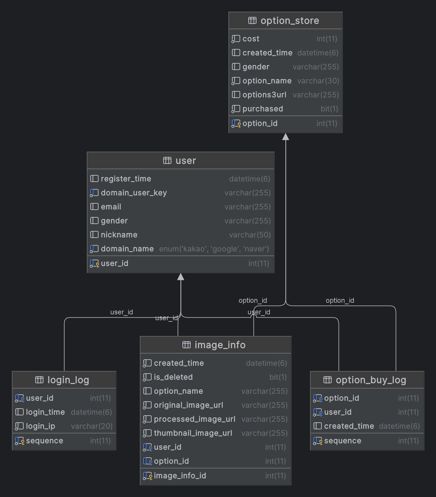

<div align="center" >
    
</div>
<div align="center">

### 내 손 안에 사진관 딸깍사진관

</div>
📢 본 프로젝트는 2024 Samsung Software Academy For Youth 10기 특화 프로젝트 일환으로 진행되었습니다.

## 프로젝트 소개
- 딸깍사진관은 사용자의 얼굴이 들어간 사진을 바탕으로 증명사진을 제작해주는 서비스입니다.
- 준비되지 않은 사진이어도 헤어스타일과 옷을 적절하게 바꾸어 제작해줍니다.
- 다양한 선택지의 옷 옵션을 적용하여 제작할 수 있으며, 추가 옵션을 구입할 수도 있습니다.

## 개발 기간
2024.02.26 ~ 2024.04.04 (6주)

## 팀원

<table>
  <tr height="140px">
        <td align="center" width="16%">
            <a href="https://github.com/gimjiyong"></a>
            <br />
            <a href="https://github.com/gimjiyong">김지용</a>
        </td>
        <td align="center" width="16%">
            <a href="https://github.com/gardengo"></a>
            <br />
            <a href="https://github.com/gardengo">고정원</a>
        </td>
        <td align="center" width="16%">
            <a href="https://github.com/neongseoman"></a>
            <br />
            <a href="https://github.com/neongseoman">박근수</a>
        </td>
        <td align="center" width="16%">
            <a href="https://github.com/ooonjae"></a>
            <br />
            <a href="https://github.com/ooonjae">이운재</a>
        </td>
        <td align="center" width="16%">
            <a href="https://github.com/jiwon2121"></a>
            <br />
            <a href="https://github.com/jiwon2121">이지원</a>
        </td>
        <td align="center" width="16%">
            <a href="https://github.com/jinddobaegi"></a>
            <br />
            <a href="https://github.com/jinddobaegi">정진영</a>
        </td>
      <tr height="50px">
        <td align="center">    
          내용
        </td>
        </td>
        <td align="center">
            <div>백엔드, 인프라</div>
            <div>로그인, 인증/인가, 결제</div>
            <div>CI/CD, HTTPS, 리버스 프록시</div>
        </td>
        <td align="center">
            내용
        </td>
        <td align="center">
            내용
        </td>
        <td align="center">
            내용
        </td>
        <td align="center">
          내용
        </td>
      </tr>
  </tr>
</table>

## 개발 환경

-   **IDE** : `IntelliJ IDEA`, `Vidsual Studeo Code`
-   **FE** : `NEXT.js 14.1.1` `React 18.0.0` `TypeScript 5.2.3` `yarn 4.1.1` `Node.js 20.10.0` `next-pwa 10.2.5` `storybook 7.6.17` `styled-components 6.1.8`
-   **BE** : `Java 17` `Gradle 7.5` `Spring Boot 3.2.3` `Spring Security 6.2.2` `Spring Data JPA 3.2.3` `Spring Cloud AWS 2.2.6` `gRPC 1.16.0`
-   **AI** : `python 3.9.13` `insightface 0.7.3` `opencv-python 4.9.0.80` `grpcio 1.62.0` `numpy 1.26.4`
-   **INFRA** : `Ubuntu 20.04.6` `Docker 25.0.4` `jenkins 2.448` `NginX 1.18.0` `mariaDB 11.3.2` `Redis 7.2.4`

## 기술 스택

### Front-end

<div>


</div>

### Back-end

<div>


</div>

### AI

<div>


</div>

### Infra

<div>


</div>

### 협업Tools

<div>


</div>

<br />

## 주요 기능

### 어플리케이션 접속 화면

- 첫 접속 화면
- 딸깍사진관을 전체적으로 소개
- 시작하기 버튼을 통해 서비스를 시작


---

- 소셜 로그인을 통해 간단하게 가입, 로그인
- 소셜 로그인은 카카오, 네이버, 구글 로그인을 지원


---

- Carousel을 통해 서비스 이용 방법과 사진 촬영 팁을 알려줌


---

- '사진 추가' 버튼을 눌러 갤러리 또는 카메라를 이용하여 사진을 불러올 수 있음
- 옵션을 선택하여 원하는 스타일을 고를 수 있음
- '딸깍' 버튼을 클릭 시 AI 모델을 사용하여 증명 사진을 생성


---

- 갤러리에서는 지금까지 생성한 증명사진을 확인 가능
- 사진을 클릭하여 상세 페이지로 이동
- 상세 페이지에서는 원본 사진과 생성된 사진을 비교할 수 있음
- 다운로드 버튼으로 원하는 사이즈의 사진으로 다운로드 가능
- 공유 버튼으로 다른 어플로 공유 가능
- 삭제 버튼으로 사진 삭제 가능


---

- 스토어에서 원하는 스타일의 옵션 구매 가능
- 구매는 카카오페이 API를 통해 구현
- 상단의 필터를 통해 전체 / 남성 / 여성 으로 필터링 가능
- 구매한 상품 탭에서 내가 구매한 상품을 확인


## 아키텍처 다이어그램


## ERD



## 시퀀스 다이어그램

### 로그인


---

### 인증/인가


---

### 결제


## 디렉토리 구조

<h3> 
<details>
<summary>frontend</summary>
<div markdown="1">

```shell
📦src
├─📂@types
│  └─📂global
├─📂assets
│  ├─📂icons
│  ├─📂images
│  └─📂styles
│     └─📂font
├─📂components
│  ├─📂calendar
│  ├─📂caregiver
│  ├─📂chart
│  ├─📂common
│  ├─📂family
│  ├─📂familyHome
│  ├─📂gallery
│  ├─📂message
│  ├─📂report
│  └─📂visit
├─📂pages
│  ├─📂caregiver
│  │  └─📂CareGiverSendMessage
│  ├─📂family
│  │  └─📂FamilyProfile
│  ├─📂Login
│  └─📂SignUp
├─📂services
│  ├─📂connect
│  ├─📂gallery
│  ├─📂health
│  ├─📂message
│  ├─📂report
│  ├─📂user
│  └─📂visit
└─📂stores
```

</div>
</details>

<h3> 
<details>
<summary>backend</summary>
<div markdown="1">

```shell
📦backend
 ┣ 📂gradle
 ┃ ┗ 📂wrapper
 ┗ 📂src
   ┣ 📂generated
   ┃ ┗ 📂main
   ┃   ┣ 📂grpc
   ┃   ┃ ┗ 📂com
   ┃   ┃   ┗ 📂ssafy
   ┃   ┃     ┗ 📂pjt
   ┃   ┃       ┗ 📂grpc
   ┃   ┗ 📂java
   ┃     ┗ 📂com
   ┃       ┗ 📂ssafy
   ┃         ┗ 📂pjt
   ┃           ┗ 📂grpc
   ┣ 📂main
   ┃ ┣ 📂java
   ┃ ┃ ┗ 📂com
   ┃ ┃   ┗ 📂ssafy
   ┃ ┃     ┗ 📂gallery
   ┃ ┃       ┣ 📂auth
   ┃ ┃       ┃ ┣ 📂exception
   ┃ ┃       ┃ ┣ 📂handler
   ┃ ┃       ┃ ┗ 📂jwt
   ┃ ┃       ┃  ┣ 📂filter
   ┃ ┃       ┃  ┗ 📂util
   ┃ ┃       ┣ 📂common
   ┃ ┃       ┃ ┣ 📂exception
   ┃ ┃       ┃ ┣ 📂response
   ┃ ┃       ┃ ┗ 📂stub
   ┃ ┃       ┣ 📂config
   ┃ ┃       ┣ 📂image
   ┃ ┃       ┃ ┣ 📂controller
   ┃ ┃       ┃ ┣ 📂exception
   ┃ ┃       ┃ ┣ 📂model
   ┃ ┃       ┃ ┣ 📂repository
   ┃ ┃       ┃ ┗ 📂service
   ┃ ┃       ┣ 📂oauth
   ┃ ┃       ┃ ┣ 📂client
   ┃ ┃       ┃ ┣ 📂config
   ┃ ┃       ┃ ┣ 📂dto
   ┃ ┃       ┃ ┗ 📂type
   ┃ ┃       ┣ 📂option
   ┃ ┃       ┃ ┣ 📂controller
   ┃ ┃       ┃ ┣ 📂dto
   ┃ ┃       ┃ ┣ 📂exception
   ┃ ┃       ┃ ┣ 📂model
   ┃ ┃       ┃ ┣ 📂repository
   ┃ ┃       ┃ ┗ 📂service
   ┃ ┃       ┣ 📂redis
   ┃ ┃       ┃ ┣ 📂dto
   ┃ ┃       ┃ ┗ 📂repository
   ┃ ┃       ┗ 📂user
   ┃ ┃         ┣ 📂controller
   ┃ ┃         ┣ 📂exception
   ┃ ┃         ┣ 📂model
   ┃ ┃         ┣ 📂repository
   ┃ ┃         ┗ 📂service
   ┃ ┣ 📂proto
   ┃ ┗ 📂resources
   ┗ 📂test
     ┗ 📂java
       ┗ 📂com
         ┗ 📂ssafy
           ┗ 📂gallery
             ┗ 📂image
               ┗ 📂repository
```

</div>
</details>

<h3> 
<details>
<summary>AI</summary>
<div markdown="1">

```shell
📦ai_backend
 ┣ 📂image
 ┃ ┣ 📂female
 ┃ ┗ 📂male
 ┗ 📂src
   ┣ 📂proto
   ┃ ┣ 📜image.proto
   ┃ ┣ 📜image_pb2.py
   ┃ ┗ 📜image_pb2_grpc.py
   ┣ 📜grpc_ai_server.py
   ┗ 📜inswapper_128.onnx
```

</div>
</details>
